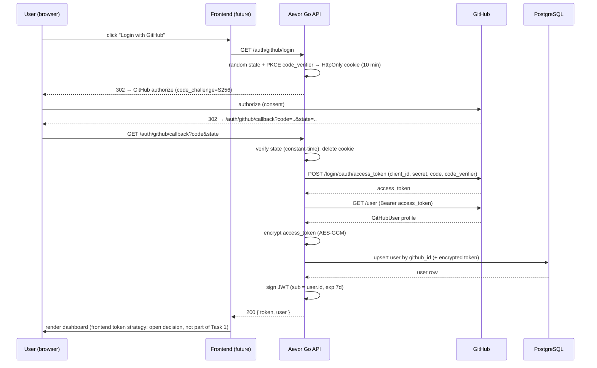

# Task 1 — GitHub OAuth Login (End-to-End) — Final Design

Status: APPROVED — final (2026-08-09). Implementation begins only after the §3 security gate is confirmed.
Owner: Developer 1.
Scope: ONE feature — authenticated identity. Nothing else.

---

## 1. Problem

Users cannot authenticate. Current state (verified in repo):

- `GET /auth/github/login` redirects to GitHub, but `RedirectURL` points to `/auth/github/callback`, which has **no route** (404).
- OAuth `state` is hardcoded `"aevor-state"` (`internal/auth/service.go:17-20`) — a CSRF hole.
- `internal/auth/jwt.go` and `internal/auth/middleware.go` are empty — no JWT, no auth middleware.
- User creation is an unauthenticated `POST /users` (`cmd/server/main.go:50`) — anyone can create arbitrary users.
- `GET /users/:id` and `GET /users/github/:id` are unauthenticated — enumeration risk.

## 2. Why this is first

The vertical slice priority is LOGIN → SYNC → SKILLS → ISSUES → RECOMMENDATION. Every later feature (GitHub data sync, skill evidence, recommendations) hangs off an authenticated identity. Nothing can be tested end-to-end without a token. Fixing this first unblocks everything else and closes three existing security holes in one task.

## 3. Prerequisites (developer actions — HARD GATE)

1. **Secrets remediation (mandatory — implementation does NOT begin until confirmed):**
   - Revoke + regenerate the GitHub OAuth client secret (github.com → Settings → Developer settings → OAuth Apps).
   - Regenerate the JWT secret in `.env`.
   - `git rm --cached services/api/.env` (keeps file locally), add `.env.example` with placeholders.
   - Purge `.env` from git history (young repo — rebase/delete is acceptable; never ask for secrets in chat).
   - **Gate confirmation:** confirm all three — (a) secret revoked/rotated, (b) `.env` untracked, (c) history cleaned — before Task 1 implementation starts.
2. GitHub OAuth app callback URL registered as `http://localhost:8080/auth/github/callback`.
3. Postgres running: `docker compose -f platform/deployments/docker/docker-compose.yml up -d`.
4. Go toolchain per `go.mod` (1.26.1).

## 4. Design decisions

| # | Decision | Why | Tradeoffs |
|---|----------|-----|-----------|
| D1 | Authorization-code flow (already scaffolded) | Code never touches the browser; only the backend sees the token | More round-trips than implicit — correct choice |
| D2 | OAuth Authorization Code **+ PKCE (S256) + state**: per request, generate a cryptographically random `state` AND a cryptographically random PKCE `code_verifier`, both stored in a short-lived HttpOnly cookie; send `code_challenge=S256` to GitHub; send the original `code_verifier` at token exchange; verify `state` on callback with constant-time compare | GitHub OAuth Apps support PKCE. PKCE protects the authorization code from interception/replay (e.g., a malicious client with a registered `redirect_uri`); `state` remains the CSRF defense. Both together are the standard for public and confidential clients | Cookie must be present on the callback request (same-origin, fine). No server-side session store needed — avoids DB/Redis infra |
| D3 | Token exchange via `golang.org/x/oauth2` (`Config.Exchange` with `oauth2.VerifierOption` for PKCE), profile fetch via a new minimal `internal/github` client | `oauth2` handles the exchange correctly; `internal/github` is a known Task-3 need (sync). Kept deliberately minimal — one method, no speculative abstractions | None material |
| D4 | Upsert user by `github_id` with `INSERT ... ON CONFLICT (github_id) DO UPDATE` | Idempotent re-login; no duplicate users; survives double-login race | Requires explicit SQL/GORM clause rather than a naive Find-then-Create |
| D5 | JWT: HS256 via `golang-jwt/jwt/v5`, claims `sub`/`iat`/`exp`(7d)/`iss`/`aud`; middleware whitelists HS256 only | Stateless sessions; no DB lookup per request; standard library | **Temporary V1 development behavior:** 7-day JWT + client-held token is a local-dev convenience. No browser token-storage strategy is designed or implemented in this task — open decision for the frontend task. Also no server-side revocation — a stolen token is valid until expiry; mitigations: short expiry, client-side discard |
| D6 | GitHub access token encrypted at rest (AES-256-GCM), key from separate env var | DB compromise must not leak GitHub tokens | Key in env (KMS is a prod upgrade); encryption key must be rotated carefully |
| D7 | Callback returns `200 {token, user}` JSON for now | No frontend exists; verifiable with curl. SPA redirect + token handling is a frontend-task concern | Not browser-optimized yet — explicitly deferred |
| D8 | New `GET /users/me`; **delete** public `POST /users`, `GET /users/:id`, `GET /users/github/:id` | `me` removes IDOR by construction; user creation belongs to OAuth upsert only. The Day-9 GitHub-ID lookup survives — it moves into the service layer (`FindOrCreateByGitHubID`) | Removes existing behavior. Alternative (keeping open user creation) is a security hole — rejected |
| D9 | Centralize config in `pkg/config`, loaded + validated once at startup, fail-fast | Today `auth/github.go` and `pkg/database` read `os.Getenv` independently; single source of truth, validated early | Small refactor of existing `pkg/database` |
| D10 | Keep GORM `AutoMigrate` for the added columns this task | One feature at a time; the versioned-migrations tool (golang-migrate) is a separate foundation task, flagged as accepted short-term debt | Noted in `docs/decisions.md` |
| D11 | Retry policy scoped to **safe/idempotent GitHub API operations only** (e.g., `GET /user`): classified transient failures (network error, timeout, HTTP 5xx) get a single bounded retry. The **authorization-code token exchange is NEVER retried** — the code is temporary/single-use and an ambiguous network failure makes re-exchange unsafe | Replaying a single-use code is invalid; only idempotent reads are safely retryable | Requires a small typed error taxonomy in the client; the exchange stays single-attempt |
| D12 | **GitHub access token** never appears in API responses, JWT claims, logs, frontend state, or error messages; the **Aevor JWT** is the only credential intentionally returned by the V1 callback | The GitHub token is the highest-value credential; confusing the two tokens is a security failure. The JWT is a session credential, not a GitHub credential | Enforced by response shaping, log redaction, and a dedicated redaction test |
| D13 | Email is **optional/best-effort** in Task 1: store only what `GET /user` returns (may be empty); no email-endpoint call, no verification, `user:email` scope dropped (least privilege), no email abstractions | The product doesn't require verified/primary email in V1; least-privilege scopes | Email display data may be empty for users with hidden emails — acceptable for V1 |

## 5. Flow (sequence)



## 6. Endpoint contract

### `GET /auth/github/login`
- Auth: none.
- Behavior: generate random `state` + random PKCE `code_verifier` → store both in `aevor_oauth_state` cookie (HttpOnly, SameSite=Lax, Path=/auth, MaxAge 600, Secure only in prod) → `302` to GitHub authorize URL with `code_challenge` derived via S256.
- Errors: none expected.

### `GET /auth/github/callback?code=<c>&state=<s>`
- Auth: none (this is the auth step).
- Behavior:
  1. Verify `state` matches the cookie value, constant-time. Mismatch/missing → `400 invalid_state` (clear cookie).
  2. GitHub may return `?error=access_denied` → `401 github_authorization_denied`.
  3. Exchange code + original `code_verifier` (from cookie) → access token. The authorization code is single-use, so the exchange is **never retried**; failure → `400 invalid_code`, user must re-login.
  4. Fetch `/user` with the token (single bounded retry on classified transient failures only).
  5. Upsert user by `github_id`; store encrypted token.
  6. Sign JWT.
- Success: `200` `{"token":"<jwt>","user":{...}}` (user shape = `users.UserResponse`).
- Errors: `400 invalid_state`, `400 invalid_code`, `401 github_authorization_denied`, `500 github_unavailable`, `500 internal` (DB).
- Security: `redirect_uri` is fixed server-side and validated by GitHub — no open redirect. **Two distinct tokens:** (a) the **GitHub access token** is a server-side secret — encrypted at rest, never in API responses, JWT claims, logs, frontend state, or error messages; (b) the **Aevor JWT is intentionally returned by the callback** — it is the session credential the frontend holds, and it is not the GitHub token. Codes/tokens/secrets are never logged. Only the JWT and non-sensitive user fields leave the backend. (Retry policy: D11, §8.)

### `GET /users/me`
- Auth: `Authorization: Bearer <jwt>`.
- Success: `200` `{"id","github_id","username","display_name","email","avatar_url"}` (no token, no internal fields; `email` best-effort, may be empty).
- Errors: `401` missing/invalid/expired token; `404` user deleted (rare).

Removed routes: `POST /users`, `GET /users/:id`, `GET /users/github/:id`.

## 7. File changes (implementation scope, post-approval)

| File | Change |
|------|--------|
| `go.mod` | add `github.com/golang-jwt/jwt/v5` |
| `pkg/config/config.go` (new) | `AppConfig` struct; `Load()` (godotenv + env); validate: JWT secret ≥32 bytes, crypto key = 32-byte hex, OAuth creds + redirect URL present; fail-fast |
| `pkg/database/{config,postgres}.go` | refactor to accept `*config.AppConfig` |
| `cmd/server/main.go` | load config once; wire auth (service, JWT manager, github client); routes: login, callback, `/users/me`; remove the 3 user routes |
| `internal/auth/types.go` | keep `GitHubUser`; add JWT claims + request-context key type |
| `internal/auth/github.go` | `NewGitHubOAuthConfig(cfg)` (config-injected, not `os.Getenv`); PKCE via `oauth2.GenerateVerifier()` / `oauth2.S256ChallengeOption()` / `oauth2.VerifierOption()`; `GenerateState()` / `VerifyState()` (crypto/rand + `subtle.ConstantTimeCompare`) |
| `internal/auth/jwt.go` | `Manager`: `Issue(userID, ttl)`, `Verify(token)` (HS256 whitelist, exp/iss/aud) |
| `internal/auth/middleware.go` | `RequireAuth(manager)` — parse Bearer, verify, inject `user_id` into `gin.Context`; `401` on failure |
| `internal/auth/service.go` | `Service{oauth, users, jwt, gh}`: `LoginURL() (url, state, verifier string, err error)`; `HandleCallback(ctx, code, state, verifier string) (token, user, error)` — exchange passes `code_verifier`; `GetProfile(ctx, userID)` |
| `internal/auth/handler.go` | handlers for the 3 routes (HTTP concerns only): set state+verifier cookie on login; read + clear it on callback |
| `internal/github/client.go` (new) | `Client.FetchUser(ctx, accessToken)` — `net/http`, 10s timeout, non-2xx → typed error, malformed JSON → error |
| `internal/users/model.go` | add `GitHubAccessToken *string` `gorm:"type:text" json:"-"` — Go `nil` ↔ PostgreSQL `NULL` (nullable TEXT); encrypted; `json:"-"` per D12. **Only** field added — no `LastSyncedAt` in Task 1 (belongs to ingestion) |
| `internal/users/repository.go` | `UpsertByGitHubID(user) error` using `ON CONFLICT (github_id) DO UPDATE` |
| `internal/users/service.go` | `FindOrCreateByGitHubID(profile, encryptedToken)` — wraps repo upsert |
| `internal/users/crypto.go` (new) | `Encrypt(plaintext, key)`, `Decrypt(ciphertext, key)` — AES-256-GCM, base64 nonce+ct |
| `.env.example` (new) | placeholders only: DB_*, GITHUB_CLIENT_ID/SECRET, GITHUB_REDIRECT_URL, JWT_SECRET, GITHUB_TOKEN_ENCRYPTION_KEY |
| `docs/api-spec.md` | update **only** the authentication endpoints + `GET /users/me`; do NOT touch skills/repositories/issues stubs (separate documentation task) |

## 8. Failure analysis (what could go wrong)

| Failure | Handling |
|---------|----------|
| GitHub down / network timeout / 5xx on `GET /user` | classified transient (network error, timeout, HTTP 5xx) → single bounded retry, then `500 github_unavailable`; frontend shows retry |
| Code already used / expired | GitHub returns error → `400 invalid_code`, clear cookie, user re-logins |
| State missing/tampered/expired | `400 invalid_state`; cookie cleared; attacker cannot forge (constant-time compare, HttpOnly) |
| User denies consent | GitHub redirects with `?error=` → `401 github_authorization_denied` |
| Double-login race (same user, two tabs) | `ON CONFLICT` upsert — single row, last write wins for profile/token |
| JWT expired/tampered/wrong-alg | middleware → `401` |
| DB down | `500 internal`; structured error; no partial state (single upsert statement) |
| Token later revoked by user on GitHub | auth still OK until GitHub rejects it during sync — documented for Task 3 |
| Oversized/malformed GitHub profile | decode error → `500 github_unavailable`; never trust shapes |

## 9. Testing plan

- **Unit:** JWT (`Issue`/`Verify`: valid, expired, wrong secret, wrong alg, tampered); state generate/verify; **PKCE verifier generation + S256 challenge derivation + verifier roundtrip at exchange**; AES-GCM encrypt/decrypt roundtrip; `HandleCallback` error mapping (mock oauth + mocked `internal/github`); **retry classification** (transient timeout/5xx on `GET /user` retried once; non-transient never; **token exchange never retried**).
- **Integration:** `UpsertByGitHubID` (create new → create duplicate → update existing) against a test Postgres (compose + separate test DB).
- **API (httptest):** callback happy path (mock GitHub via `httptest.Server`), invalid state, denied, missing code; `/users/me` with valid / missing / expired token.
- **GitHub client:** mock `/user` → 200, 401, 500, malformed JSON.
- **Redaction (D12):** assertions that the GitHub access token appears in **no** API response body, no error message, and no log output.
- **No real GitHub calls in tests.** No `.env` secrets in tests — env injected per test.

## 10. Verification (post-implementation, you run)

```bash
cd platform/services/api
go build ./... && go vet ./... && go test ./...
docker compose -f ../deployments/docker/docker-compose.yml up -d
go run ./cmd/server
# manual flow (browser or curl):
# 1. open http://localhost:8080/auth/github/login → redirected to GitHub
# 2. authorize → redirected back to callback
# 3. callback returns { token, user }
# 4. curl -H "Authorization: Bearer <token>" http://localhost:8080/users/me
```

## 11. Documentation updates (part of the task)

- `docs/decisions.md` — D1–D13 ADR entries.
- `docs/architecture.md` — auth component section.
- `docs/api-spec.md` — authentication contract only (§6); unrelated stubs untouched.
- `docs/learning.md` — concepts: OAuth auth-code flow, **PKCE (S256 challenge/verifier)**, state/CSRF, **JWT vs GitHub access token**, JWT structure + HS256 vs RS256, revocation gap, AES-GCM at-rest encryption, upsert/`ON CONFLICT`, `context.Context`, HTTP timeout/retry.
- `docs/interview-notes.md` — §19-format Q&A: OAuth, **PKCE**, state/CSRF, **JWT vs GitHub token**, revocation, IDOR, idempotent upsert, **retry policy**, failure handling.

## 12. Explicitly out of scope (not in this task)

- Refresh tokens, server-side revocation, logout endpoint (client discards token).
- **Frontend token-storage strategy** (open decision — deliberately not designed here; arrives with the frontend task).
- CORS setup (arrives with the frontend task).
- Versioned migrations tool (separate foundation task; AutoMigrate retained for this change).
- GitHub rate-limit handling (sync task).
- Any sync / skills / recommendation work.

---

## Revision history

The body above is the single, final approved design for Task 1. Key corrections incorporated during review:

1. OAuth Authorization Code **+ PKCE (S256) + state** (GitHub OAuth Apps support PKCE): random `state` + random `code_verifier` per request, both stored in the short-lived HttpOnly cookie; `code_challenge=S256` sent to GitHub; original `code_verifier` sent at token exchange. (D2, D3)
2. **Token exchange is never retried** (single-use code). Bounded single retry applies only to idempotent `GET /user` on classified transient failures. (D11)
3. **GitHub access token vs Aevor JWT explicitly distinguished**; the GitHub token never appears in API responses, JWT claims, logs, frontend state, or error messages. (D12)
4. Email is **optional/best-effort**; `user:email` scope dropped; no email abstractions. (D13)
5. `GitHubAccessToken *string` with `gorm:"type:text" json:"-"` — Go `nil` ↔ PostgreSQL `NULL` consistent. (§7)
6. 7-day JWT + client-held token labeled **temporary V1 development behavior**; no browser token-storage strategy designed here. (D5)
7. `LastSyncedAt` excluded from Task 1; `internal/github` kept minimal; unrelated API docs untouched; docs updates scoped to the authentication contract. (§7, §11)
8. §3 security gate is mandatory and unchanged: implementation does not begin until secrets are revoked/rotated, `.env` is untracked, and git history is cleaned.
